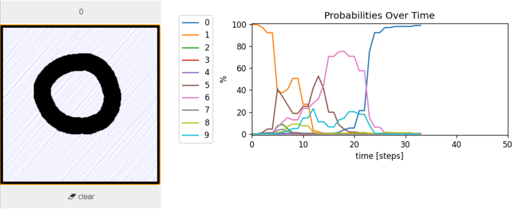
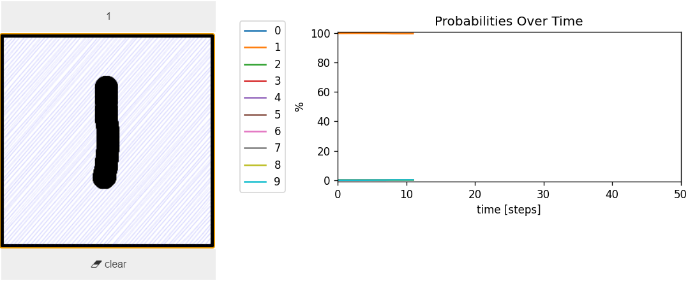
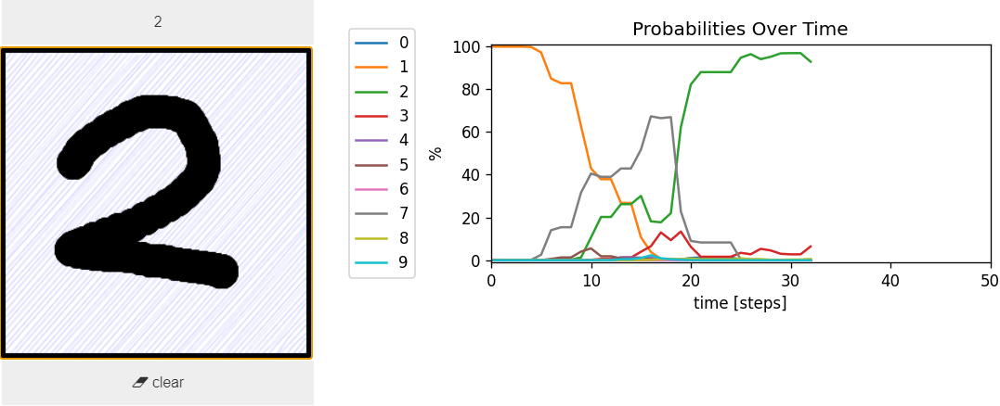
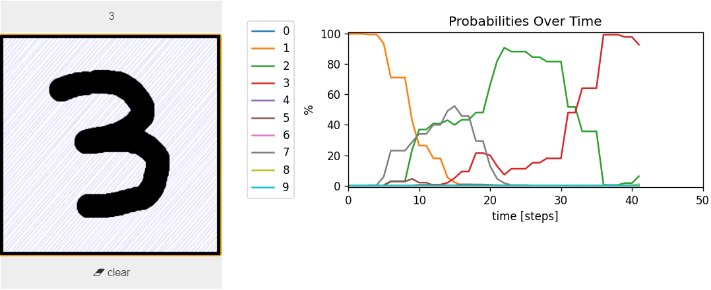
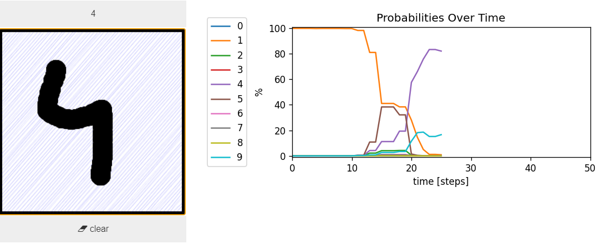
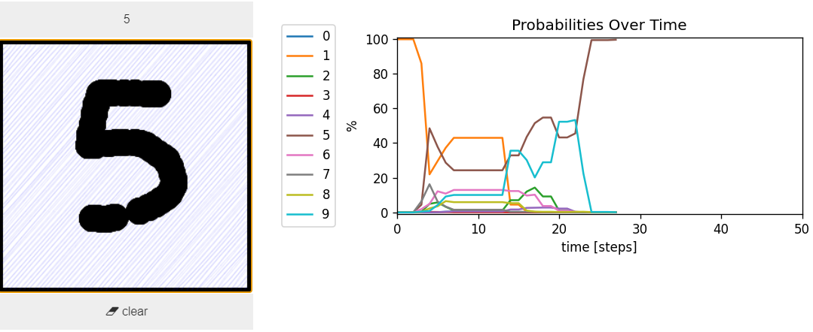
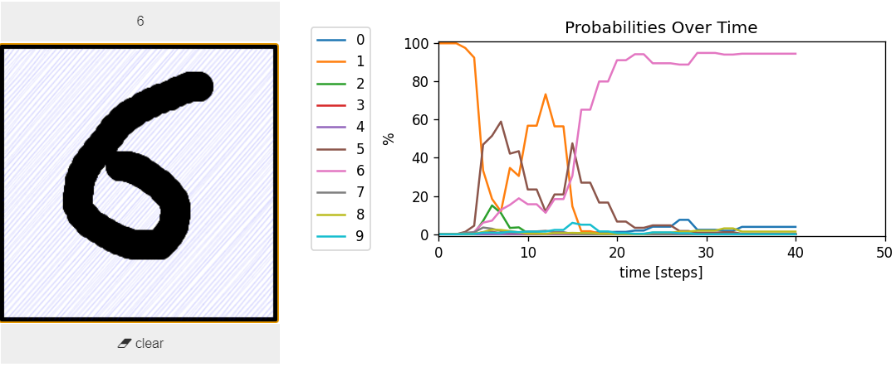
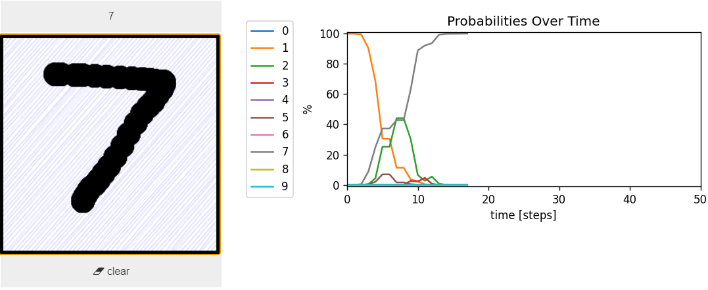
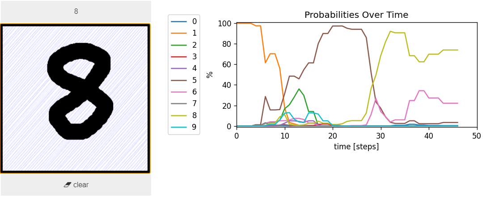
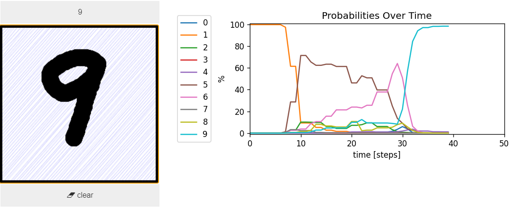

# Digits stroke classification
<!--   -->
<!-- > For completeness sake I have included a link to binder so you can try it out for yourself but note that it is *extremely* slow. -->
This repo showcases using [ROCKET](https://arxiv.org/abs/1910.13051) (Angus Dempster et al.) on [sequential MNIST data](https://github.com/edwin-de-jong/mnist-digits-stroke-sequence-data/wiki/MNIST-digits-stroke-sequence-data) ([Edwin D. de Jong](https://edwin-de-jong.github.io/)).

Note that this dataset simulates an actual pen stroke and is thus not, as is often done, MNIST images flattened to a 1D vector to be then used sequentially. See [here](https://github.com/edwin-de-jong/mnist-digits-stroke-sequence-data/wiki/MNIST-digits-stroke-sequence-data#examples) for an example.

## Results
> This is sped up by around 2x.

Expand for static images

  

## Reproducing
You can either clone this repository yourself or just run `demo.ipynb` using docker.

> To clone, open a terminal in the folder want to copy this repo too, and run:
>
> `git clone https://github.com/tobemo/tobemo.github.io.git`

> Using docker:
> 1. open a terminal and run:
> 
> `docker run -p 8888:8888 --rm tobemo/demo`
> 
> 2. navigate to http://localhost:8888/notebooks/demo.ipynb;
>
> This pulls the image `tobemo/demo` that can be found on [Docker Hub](https://hub.docker.com/r/tobemo/demo/tags) [ 1.47 GB / 1.37 GB compressed].

**Please do report any issues.**
